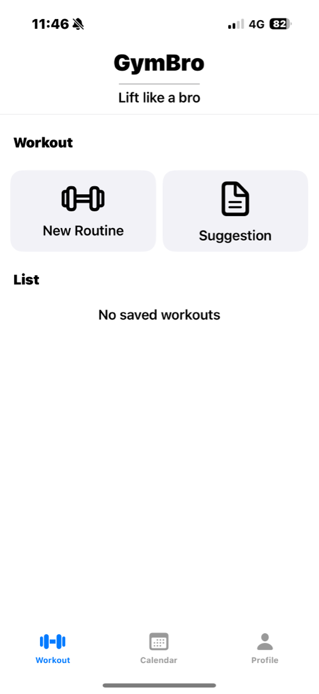

# GymBro - Lift Like a Bro
This is an iOS app built with Xcode that helps users to manage their workout.

##Screenshot
}
}
}

## Features
- Bid database of excercices (Implemented by an Api)
- Add, edit, and delete workout
- Assing workouts to specific days
- Set your personal profile
- VoiceOver support 

##Credit
-[RapidApi] - https://rapidapi.com/justin-WFnsXH_t6/api/exercisedb

## Installation
1. Clone this repository: `git clone <https://github.com/your-username/your-repo-name.git`>
2. Open the project in Xcode.
3. Run the app on a simulator or connected device.

#License
All right reserved
